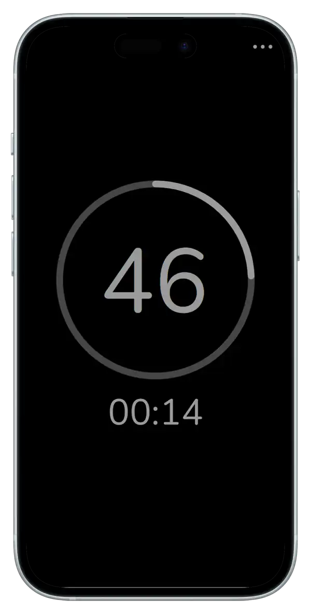

#  tima
'tima' is a straightforward HTML/JavaScript-based web application designed to display a countdown timer set for one minute. The timer provides audible alerts at specific intervals: it beeps once at 15 seconds, once at 30 seconds, and once at 45 seconds. When the countdown reaches zero (after one minute), it beeps three times to signal the end of the cycle. The timer then automatically resets and starts the countdown again.

Additionally, 'tima' offers customization options, allowing users to modify the beep intervals and adjust the total duration of the countdown to suit their needs. This makes it a versatile tool for timing tasks, exercises, or any activity requiring a simple, customizable timer

> [!TIP]
> You can use 'tima' directly in your browser by accessing the [online page](https://zenziwerken.github.io/tima/), or you can install it as a web app for quick and easy access. If you prefer offline use, simply download the HTML file and open it in your browser—no internet connection required. This flexibility ensures you can use 'tima' anytime, anywhere!

Blipsound from [pixabay](https://pixabay.com/de/sound-effects/blip-131856/) (User u_f1ee7vf7na).

